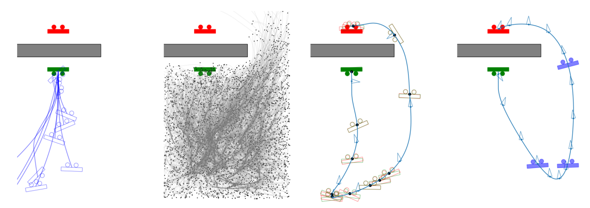
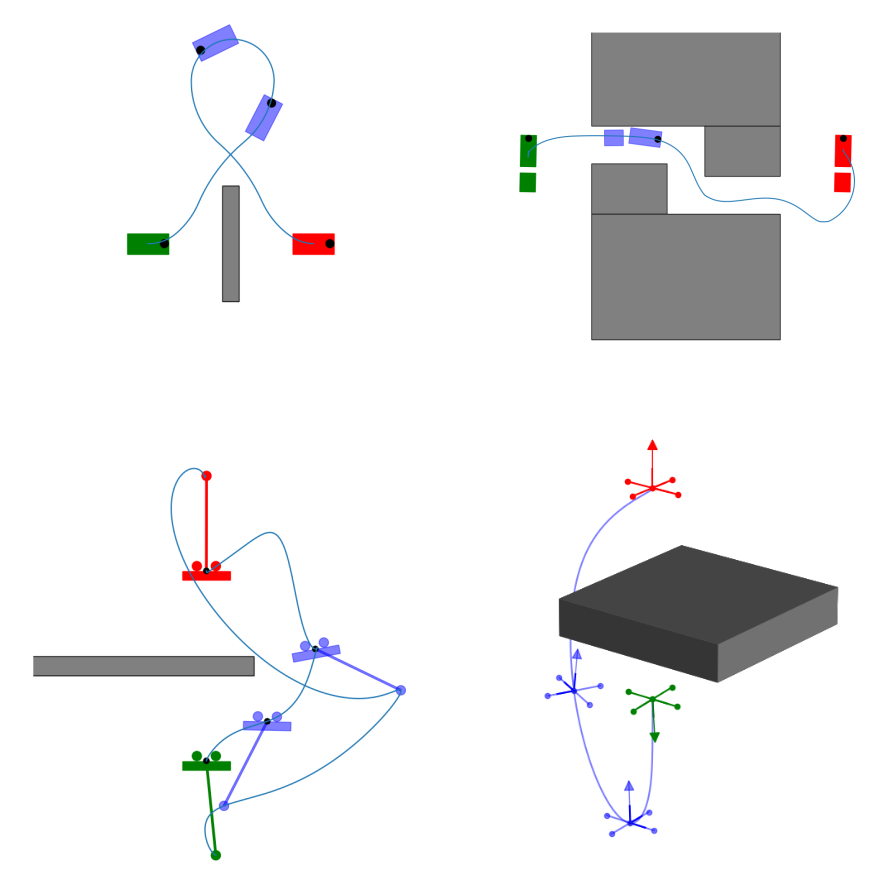

# Dynoplan 🦖

Dynoplan is a small library for solving kinodynamic motion planning problems, as defined in [Dynobench](https://github.com/quimortiz/dynobench) :t-rex:. It implements 3 different algorithms: Trajectory Optimization with geometric initial guess (RRT*-TO), Sample based Motion Planning (SST*), and Iterative Search and Optimization (iDb-A*).

<p align="center">

</p >


The first version [kinodynamic-motion-planning-benchmark](https://github.com/imrCLab/kinodynamic-motion-planning-benchmark) is now deprecated.

## Robots and Problem Description

Kinodynamic motion planning problem are defined in [Dynobench](https://github.com/quimortiz/dynobench)


<p align="center">

</p >


## Examples and Tests

Check the tests in `test` to learn how to use the code!

## Planners

- Trajectory Optimization: several algorithms for optimization with free terminal time, built on top of Differential Dynamic Programming (Crocoddyl).
- RRT*-TO: Geometric Planner RRT* (OMPL)  + Trajectory Optimzation
- iDb-A*: Iterative disccontinuity bounded search and Trajectory Optimization
- SST*: Stable Sparse Tree (OMPL)
- Dbrrt, AO-dbrrt and DBrrtConnect, DB-SST* (coming soon!)

## Building

You can check the Github CI [cmake.yml](.github/workflows/cmake.yml) to see how to compile the project in latest ubuntu (For ubuntu 20.04, we experienced some issues with g++-9, but clang-13 is fine.)

Dependencies:

* Boost
* fcl (0.7)
* yaml-cpp
* Eigen3
* Crocoddyl (1.8)
* OMPL (1.6)

We need OMPL 1.6 for planners RRT + TO and  SST. We recommend to install OMPL in a local directory with -DCMAKE_INSTALL_PREFIX, and use -DCMAKE_PREFIX_PATH here

## Motion Primitives

You will find a small set of motion primitives for each system in [dynobench](https://github.com/quimortiz/dynobench). 5000 primitives per system are available in [dynomotions](https://github.com/quimortiz/dynomotions). These primitives are required for running the test.

Finally, the comple set of primitives for each system can be downloaded from Google Drive. This can be done manually with a web browser or using the command line with [gdown](https://github.com/wkentaro/gdown). This is required to run the benchmark. For example:

```
gdown --fuzzy "https://drive.google.com/file/d/1r_ecGwdfvWnVWxPsvR4d8Hjcayxg5PsB/view?usp=drive_link"
```
We provide the script `download_primitives.bash` to download all primitives, that will be stored in folder `dynomotions_full`.

All primitive in two ZIP files:  https://drive.google.com/drive/folders/1-Nvctva17I8aFsWvHfdQFWTIDUNWwgcM?usp=drive_link

Primitves per system:

* unicycle1_v0
https://drive.google.com/file/d/15dXqC_OdrI8KjaHRNakYgk9IXLtTeMtt/view?usp=drive_link

* quadrotor_v1 (OMPL-style)
https://drive.google.com/file/d/1r_ecGwdfvWnVWxPsvR4d8Hjcayxg5PsB/view?usp=drive_link

* quadrotor_v0
https://drive.google.com/file/d/1j57kwE5hFgO-46LjStv_zqm6S5BFUsY8/view?usp=drive_link

* Acrobot_v0
  https://drive.google.com/file/d/1mLiTgcpXSI9UHHss4Qt7AIsRwJPbPC2H/view?usp=drive_link

* Roto_Pole_v0
https://drive.google.com/file/d/1KMb4IDgucHN8uWI9YN_W07AhX59tkph_/view?usp=drive_link

* Planar Rotor_v0
https://drive.google.com/file/d/18kI3qXweA4RgvDxtV3vfxnfc_BhX52j8/view?usp=drive_link

* Car1_v0
https://drive.google.com/file/d/1TPX3c8RvMOy9hiaKL-kUE8M61OknDrDK/view?usp=drive_link

* Unicycle 2 _v0
  https://drive.google.com/file/d/1PoK1kbiLRFq_hkv3pVWU0csNr4hap0WX/view?usp=drive_link

* Unicycle 1 v2
https://drive.google.com/file/d/1IvwN-e1jn5P0P1ILaVwSrUnIeBlFxhHI/view?usp=drive_link

* Unicycle 1 v1
https://drive.google.com/file/d/1OLuw5XICTueoZuleXOuD6vNh3PCWfHif/view?usp=drive_link


## How to generate motion primitives for new systems

We will show how to generate motion primitives for the `integrator1_2d_v0`

* Step one: Implement the Dynamics in Dynobench, following the tutorial for the `Integrator2_2d` in the `README` (in this case `integrator1_2d_v0` is already implemented)

* Step two: Solve Optimization Problems with Random Start and Goals
```
./main_primitives --mode_gen_id 0  --dynamics integrator1_2d_v0 --models_base_path ../dynobench/models/   --max_num_primitives 200 --out_file /tmp/my_motions.bin
```
Primitives will be store in `/tmp/my_motions.bin` and `/tmp/my_motions.bin.yaml`.  You can pass options to the solver for trajectory optimization. 

* Step Three: Improve the cost of the primitives

```
./main_primitives --mode_gen_id 1  --dynamics integrator1_2d_v0 --models_base_path ../dynobench/models/   --max_num_primitives 200  --in_file /tmp/my_motions.bin --solver_id 1
```

By default, primitives are stored in `/tmp/my_motions.bin.im.bin` and `/tmp/my_motions.bin.im.bin.yaml`. You can pass options to the solver for trajectory optimization. 


* Step Fours: Randomnly cut primitives

```
./main_primitives --mode_gen_id 2 --in_file     /tmp/my_motions.bin.im.bin    --max_num_primitives -1   --max_splits 1  --max_length_cut 50  --min_length_cut 5 --dynamics integrator1_2d_v0 --models_base_path ../dynobench/models/
```

By default, primitives will be stored in `/tmp/my_motions.bin.im.bin.sp.bin` and `/tmp/my_motions.bin.im.bin.sp.bin.yaml`


Done!

Additionally, `main_primitives` provide more useful functionality, such as conversion between formats, computing statistics, generating primitives with random rollouts, sorting primitives and resampling of primitives.


## Benchmark

Results of reported in our TRO paper are in folder `tro_results`. To replicate the results use commit: `xxxxx`. The code is under continuous development, but the benchmark should work also with newer commits. If you experience any problem, please open an ISSUE.

First, download primitives with:

```
bash -x download_primitives.bash
```

Primitvies are stored in a new `dynomotions_full` directory. Next, move to the `build` directory and run commands:

Benchmark between planners

```
python3 ../benchmark/benchmark.py -m bench -bc    ../benchmark/config/compare.yaml
```

Study of heuristic functions

```
python3 ../benchmark/benchmark.py -m bench_search -bc    ../benchmark/config/bench_search.yaml
```

Study of strategy for trajectoy optimization with free terminal time
```
python3 ../benchmark/benchmark.py -m bench_time -bc    ../benchmark/config/bench_time.yaml
```

Study of time spent in each component

```
python3   ../benchmark/benchmark.py -m study  -bc ../benchmark/config/bench_abblation_study.yaml
```

You can modify each config file to change the number of runs, the evaluated problems and the maximum time.
The configurations files we used for `TRO` have prefix `TRO`.

The paramteres for each algorithm are in `.yaml` files inside the `benchmark/config/algs` directory, for example `idbastar_v0.yaml`.


## Citing

If you use or work for academic research, please cite:

```
COOL TRO paper
```


```
@online{hoenigDbADiscontinuityboundedSearch2022,
  title = {Db-A*: Discontinuity-Bounded Search for Kinodynamic Mobile Robot Motion Planning},
  author = {Hoenig, Wolfgang and Ortiz-Haro, Joaquim and Toussaint, Marc},
  year = {2022},
  eprint = {2203.11108},
  eprinttype = {arxiv},
  url = {http://arxiv.org/abs/2203.11108},
  archiveprefix = {arXiv}
}
```
